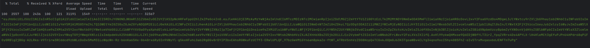

# Desafio People Pro - Desenvolvedor Backend
Proposta de solução do teste prático para desenvolvedor

## Descrição

O desafio pede a implementação de uma aplicação com interface API Rest para o cadastro de usuários. A API deverá permitir:

1. Cadastrar usuários;
2. Alterar os dados de um usuário;
3. Obter uma lista de todos os usuários cadastrados;
4. Obter um usuário pelo seu identificador;
5. Inativar um usuário (remoção lógica).

## Tecnologias Utilizadas

- Java 21
- Spring Boot 3.2.5
- JPA
- MySQL 8.0
- Maven
- KeyCloak
- Flyway
- Docker/Docker compose

## Configuração do Projeto para Desenvolvimento

O desenvolvedor deverá ter instalado em sua máquina o JDK 21, além do Docker e Docker Compose. Se a IDE usada para desenvolvimento não der suporte para o Maven, então, o mesmo deverá ser instalado.

## Execução do Projeto

Antes de executar o projeto, faz-se necessário verificar se o Docker e Docker Compose estão instalados na máquina.

### Como Executar

Para executar o projeto localmente, deve-se usar o script `bin/start.sh`. Após sua execução, a documentação da API, exposta através do Swagger UI, pode ser visualizada através do link:

[Usuários - API](http://localhost:8989/swagger-ui/index.html)

Os endpoints apresentados na documentação encontram-se protegidos pelo protocolo de autorização OAuth 2.0. Assim, para chamá-los será, necessário passar no request um token de acesso JWT válido.
A geração desse token será realizada através do serviço de autenticação e autorização *Keycloak*, iniciado durante a execução do projeto.

Em um terminal, execute o script `bin/access-token.sh` para obter um novo token de acesso. O resultado deverá ser semelhante ao exibido abaixo:

*A propriedade "username" presente no token JWT será usada para preenchimento dos campos "createdBy" e "updatedBy" no cadastro de usuários*

Para parar a execução do projeto, basta usar o script `bin/stop.sh`.

## Estrutura do Projeto

O projeto foi organizado seguindo o padrão **Domain Driven Design (DDD)** com uma **arquitetura hexagonal**. O contexto **Core** está estruturado da seguinte forma:

- **domain**: Grupo que contêm as classes de domínio diretamente relacionadas às regras de negócio da aplicação.

- **application**: Grupo que contêm uma categoria de adaptadores que encaminham adequadamente chamadas externas para métodos presentes nas portas de entrada.

- **infrastructure**: Grupo que recebe as chamadas geradas a partir das classes de domínio, que possuem acesso às portas de saída, e as direciona para um sistema externo, por exemplo, uma base de dados relacional.

## Versionamento da Base de Dados

A criação e o gerenciamento da base de dados MySQL é realizado por meio da ferramenta **Flyway**. Uma única migration foi criada; ela é usada para criar as tabelas da aplicação e gerar as demais estruturas de dados, inclusive as tabelas de auditoria.
